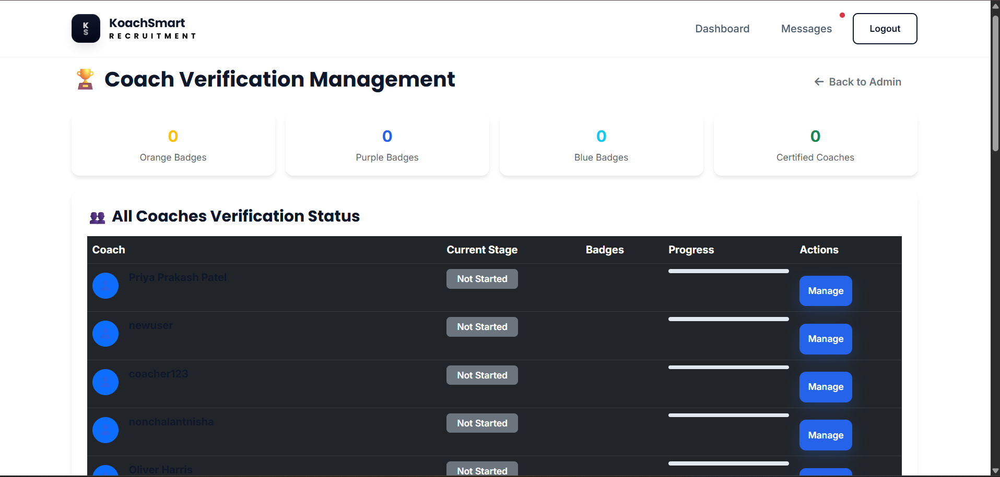

# 🏆 Advanced Verification System - Test Checklist

## 🚀 **QUICK START TESTING**

### Prerequisites
1. ✅ Application is running: `py app.py`
2. ✅ Database tables created (verification models)
3. ✅ Test user accounts created (coach, employer, admin)

---

## 📋 **PHASE 1: CRITICAL FUNCTIONALITY TESTS**

### ✅ **1. Verification Dashboard Access**
- [ ] **Coach Dashboard Link**: Go to coach dashboard → Click "Verification Center"
- [ ] **URL Access**: Direct access to `/verification/dashboard`
- [ ] **Role Protection**: Only coaches can access verification system
- [ ] **Dashboard Loads**: No errors, shows 4-stage progress
- [ ] **Current Stage Display**: Shows correct current stage

**Test Steps:**
```bash
1. Login as coach
2. Go to /dashboard
3. Click "Verification Center" button
4. Verify dashboard loads with 4 stages displayed
5. Check current stage is highlighted
```

### ✅ **2. Stage 1: Basic Verification (Orange Badge)**
- [ ] **Stage 1 Access**: `/verification/stage1` loads correctly
- [ ] **Name Verification**: Can enter and verify full name
- [ ] **Phone Verification**: Can enter phone and request OTP
- [ ] **OTP Process**: OTP generation and verification works
- [ ] **Email Verification**: Can send verification email
- [ ] **Aadhar Verification**: Can enter and verify Aadhar number
- [ ] **Username Creation**: Can create unique username
- [ ] **Slug Generation**: Creates public coach profile URL
- [ ] **Stage Completion**: Orange badge awarded when all items complete
- [ ] **Coin Rewards**: Receives coins for each verification (+50 each)
- [ ] **Bonus Coins**: +100 bonus coins for stage completion

**Test Steps:**
```bash
1. Go to /verification/stage1
2. Complete each verification item:
   - Enter full name
   - Verify phone (use displayed OTP)
   - Verify email (check email or use direct link)
   - Enter 12-digit Aadhar number
   - Create unique username
3. Check orange badge is awarded
4. Verify public profile created at /coach/username
5. Check coin balance increased
```

### ✅ **3. Stage 2: Location & Availability (Purple Badge)**
- [ ] **Stage 2 Access**: Only accessible after Stage 1 completion
- [ ] **Language Selection**: Can select preferred language
- [ ] **Location Setting**: Can set state, city, coordinates
- [ ] **Job Type Selection**: Can select working preferences
- [ ] **Range Setting**: Can set serviceable area range
- [ ] **Stage Completion**: Purple badge awarded
- [ ] **Coin Rewards**: +500 coins for stage completion

**Test Steps:**
```bash
1. Complete Stage 1 first
2. Go to /verification/stage2
3. Fill location form:
   - Select language
   - Enter state and city
   - Set job type preferences
   - Set range in kilometers
4. Submit form
5. Check purple badge awarded
6. Verify coin balance increased by 500
```

### ✅ **4. Stage 3: Education & Experience (Blue Badge)**
- [ ] **Stage 3 Access**: Only accessible after Stage 2 completion
- [ ] **Education Form**: Can add qualifications and specialization
- [ ] **Experience Form**: Can add coaching experience details
- [ ] **Document Upload**: Can upload education/certification documents
- [ ] **File Validation**: Only allows PDF, DOC, image files
- [ ] **Stage Completion**: Blue badge awarded
- [ ] **Coin Rewards**: +1000 coins for stage completion

**Test Steps:**
```bash
1. Complete Stages 1 & 2 first
2. Go to /verification/stage3
3. Add education details
4. Add experience details
5. Upload a test document (PDF/image)
6. Check blue badge awarded
7. Verify coin balance increased by 1000
```

### ✅ **5. Stage 4: Advanced Certifications (Green Badge)**
- [ ] **Stage 4 Access**: Only accessible after Stage 3 completion
- [ ] **Certification Forms**: Can mark advanced certifications complete
- [ ] **First Aid Certification**: +550 coins
- [ ] **Coaching Principles**: +500 coins
- [ ] **Soft Skills**: +500 coins
- [ ] **CV Upload**: Can upload professional CV
- [ ] **Stage Completion**: Green badge awarded (Certified Coach!)
- [ ] **Final Rewards**: +2000 bonus coins for completion

**Test Steps:**
```bash
1. Complete Stages 1, 2 & 3 first
2. Go to /verification/stage4
3. Mark certifications as complete:
   - First Aid Certified
   - Coaching Principles Certified
   - Soft Skills Certified
4. Upload CV document
5. Check green badge awarded
6. Verify "Certified Coach" status
7. Check final coin balance (should be 4000+ total)
```

---

## 📋 **PHASE 2: PUBLIC PROFILE TESTS**

### ✅ **6. Coach Slug Pages (Public Profiles)**
- [ ] **Public URL Access**: `/coach/username` loads correctly
- [ ] **Profile Information**: Shows coach name, sport, experience
- [ ] **Badge Display**: Shows earned verification badges
- [ ] **Verification Status**: Shows completed verification stages
- [ ] **Contact Section**: Shows contact options (requires registration)
- [ ] **Stats Display**: Shows profile views and statistics
- [ ] **SEO Meta Tags**: Page has proper title and description
- [ ] **Mobile Responsive**: Works on mobile devices
- [ ] **View Counter**: Increments page views when visited

**Test Steps:**
```bash
1. Complete Stage 1 to get username
2. Visit /coach/your-username (replace with actual username)
3. Check profile displays correctly
4. Verify badges show based on completion
5. Test on mobile device
6. Refresh page and check view counter increases
```

### ✅ **7. Profile Integration**
- [ ] **Dashboard Integration**: Verification status shows on main dashboard
- [ ] **Profile Completion**: Verification affects profile completion %
- [ ] **Badge Display**: Badges show in user profile sections
- [ ] **Public Profile Link**: Link to public profile available
- [ ] **Search Integration**: Verified coaches rank higher in searches

---

## 📋 **PHASE 3: ADMIN VERIFICATION TESTS**

### ✅ **8. Admin Dashboard Integration**
- [ ] **Admin Menu**: "Coach Verification" link in admin dashboard
- [ ] **Access Control**: Only admins can access verification management
- [ ] **Overview Stats**: Shows badge counts and statistics
- [ ] **Pending Documents**: Lists documents awaiting verification

**Test Steps:**
```bash
1. Login as admin user
2. Go to /super-admin
3. Click "Coach Verification" button
4. Verify admin verification dashboard loads
5. Check statistics display correctly
```

### ✅ **9. Document Management**
- [ ] **Document List**: Shows all uploaded documents
- [ ] **Verification Status**: Can approve/reject documents
- [ ] **Admin Notes**: Can add verification notes
- [ ] **Status Updates**: Document status updates correctly
- [ ] **Audit Trail**: Tracks who verified what and when

**Test Steps:**
```bash
1. As coach: Upload documents in verification stages
2. As admin: Go to coach verification dashboard
3. Review pending documents
4. Approve/reject documents with notes
5. Check status updates correctly
6. Verify audit trail is maintained
```

### ✅ **10. Coach Management**
- [ ] **Coach List**: Shows all coaches with verification status
- [ ] **Progress Tracking**: Shows completion progress for each coach
- [ ] **Badge Override**: Admin can manually award badges if needed
- [ ] **Detailed View**: Can view individual coach verification details
- [ ] **Bulk Actions**: Can perform actions on multiple coaches

---

## 📋 **PHASE 4: INTEGRATION TESTS**

### ✅ **11. Dashboard Integration**
- [ ] **Verification Button**: Shows in coach dashboard quick actions
- [ ] **Profile Completion**: Verification stages affect completion %
- [ ] **Badge Display**: Badges show in dashboard profile section
- [ ] **Progress Indicators**: Shows verification progress

### ✅ **12. Job Application Integration**
- [ ] **Verified Badge**: Shows in job applications
- [ ] **Match Scoring**: Verification affects job match scores
- [ ] **Employer View**: Employers can see coach verification status
- [ ] **Priority Ranking**: Verified coaches rank higher

### ✅ **13. Search & Discovery**
- [ ] **Search Results**: Verified coaches appear first
- [ ] **Filter Options**: Can filter by verification status
- [ ] **Badge Filters**: Can filter by specific badges
- [ ] **Public Directory**: Verified coaches in public listings

---

## 📋 **PHASE 5: ERROR HANDLING & EDGE CASES**

### ✅ **14. Error Scenarios**
- [ ] **Invalid Phone**: Handles invalid phone numbers gracefully
- [ ] **Invalid Email**: Handles invalid email addresses
- [ ] **Invalid Aadhar**: Validates 12-digit Aadhar format
- [ ] **Duplicate Username**: Prevents duplicate usernames
- [ ] **File Upload Errors**: Handles invalid file types/sizes
- [ ] **Network Errors**: Handles OTP/email sending failures
- [ ] **Database Errors**: Handles database connection issues

### ✅ **15. Security Tests**
- [ ] **Role Protection**: Non-coaches cannot access verification
- [ ] **Stage Progression**: Cannot skip stages
- [ ] **File Security**: Uploaded files are secure
- [ ] **Input Validation**: All inputs are properly validated
- [ ] **SQL Injection**: Protected against SQL injection
- [ ] **XSS Protection**: Protected against cross-site scripting

### ✅ **16. Performance Tests**
- [ ] **Page Load Speed**: All pages load within 2 seconds
- [ ] **File Upload Speed**: Documents upload efficiently
- [ ] **Database Queries**: Optimized database queries
- [ ] **Concurrent Users**: Handles multiple users simultaneously
- [ ] **Memory Usage**: No memory leaks during verification

---

## 🧪 **AUTOMATED TEST SCRIPT**

### Quick Verification Test
```bash
# Run this script to test basic verification functionality
py test_verification_system.py
```

### Manual Test Commands
```bash
# Test database setup
py -c "from models.verification import VerificationStage; print('Verification models loaded successfully')"

# Test route registration
py -c "from routes.verification_routes import verification_bp; print('Verification routes loaded successfully')"

# Test service functions
py -c "from services.verification_service import VerificationService; print('Verification service loaded successfully')"
```

---

## 📊 **SUCCESS CRITERIA**

### ✅ **Phase 1 Success**: Critical functionality works
- All 4 verification stages complete successfully
- Badges awarded correctly
- Coins distributed properly
- Public profiles created

### ✅ **Phase 2 Success**: Integration works
- Dashboard integration complete
- Admin management functional
- Document verification working

### ✅ **Phase 3 Success**: Production ready
- Error handling robust
- Security measures in place
- Performance acceptable
- Mobile responsive

---

## 🚨 **COMMON ISSUES & SOLUTIONS**

### Issue 1: Verification Dashboard Not Loading
**Solution**: Check if verification blueprint is registered in app_factory.py

### Issue 2: OTP Not Working
**Solution**: Check email configuration in .env file

### Issue 3: File Upload Failing
**Solution**: Ensure upload directories exist and have proper permissions

### Issue 4: Badges Not Awarding
**Solution**: Check database transactions are committing properly

### Issue 5: Public Profile 404
**Solution**: Verify slug creation and CoachSlugPage model

---

## 🎯 **TESTING PRIORITY**

### **HIGH PRIORITY** (Must Pass)
1. ✅ Stage 1 basic verification
2. ✅ Badge awarding system
3. ✅ Public profile creation
4. ✅ Admin verification dashboard

### **MEDIUM PRIORITY** (Should Pass)
5. ✅ Document upload system
6. ✅ Advanced certification stages
7. ✅ Integration with main dashboard
8. ✅ Mobile responsiveness

### **LOW PRIORITY** (Nice to Have)
9. ✅ Performance optimization
10. ✅ Advanced admin features
11. ✅ SEO optimization
12. ✅ Analytics tracking

---

## 🏁 **FINAL VERIFICATION**

### Complete System Test
1. **Create new coach account**
2. **Complete all 4 verification stages**
3. **Earn all 4 badges (Orange, Purple, Blue, Green)**
4. **Verify public profile works**
5. **Test admin verification management**
6. **Confirm integration with main app**

**If all tests pass, your verification system is ready for production! 🎉**